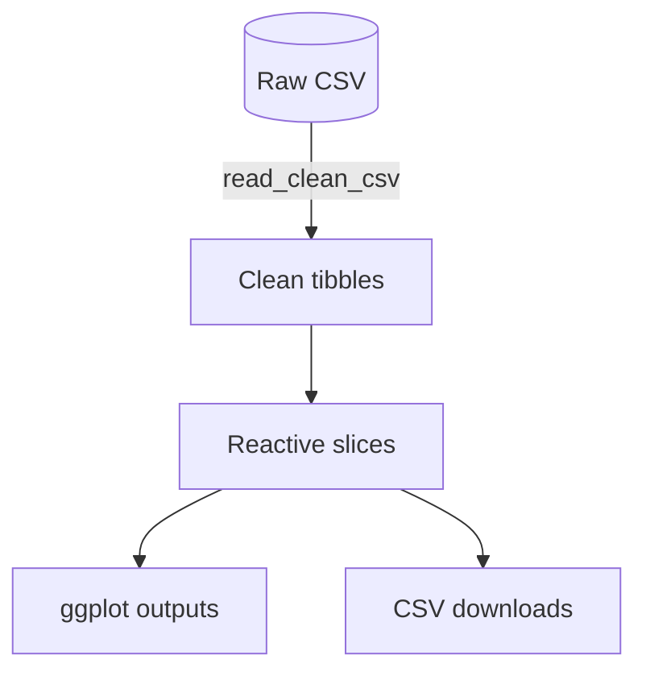

# Sley HORTES
# 411221407

---

## 1  Project Title

**Taiwan – Global Footprint Dashboard**

## 2  Project Overview

This interactive **R Shiny** application ties together six data domains—macroeconomy, democracy, equities, tourism, salary micro‑data and raw tables—into a single dashboard. A shared sidebar lets users synchronise the year window and peer‑country choices so that every tab tells the same time‑sliced story.

## 3  Motivation

1. \*\*Economic curiosity \*\*— Headlines often claim Taiwan is the “silicon shield.” I wanted hard, reproducible numbers.
2. \*\*Tech fascination \*\*— NVIDIA, Apple and Microsoft all depend on TSMC wafers; tracing that dependency via stock prices felt like the perfect data‑science challenge.
3. \*\*Civic perspective \*\*— Visualising the democracy gap between Taiwan and mainland China adds context to current geopolitical debates.

## 4  How to Run the App

\### 4.1 Package Installation

```r
if (!require(tidyverse)) install.packages("tidyverse")
if (!require(shiny))    install.packages("shiny")
```

\### 4.2 Launching the App

```r
shiny::runApp("app.R")
```

\### 4.3 Sidebar Controls

| Control                                                  | Purpose                                                         |
| -------------------------------------------------------- | --------------------------------------------------------------- |
| **Year range** slider                                    | Aligns the x‑axis on every plot                                 |
| **Compare GDP/Democracy**                                | Choose one or more peer economies                               |
| **Tab‑specific inputs**                                  | Stock tickers, salary variable, etc., appear only when relevant |
| ### 4.4 Downloads                                        |                                                                 |
| Two buttons export the live Democracy and Salary slices: |                                                                 |

```r
output$dl_democracy <- downloadHandler(
  filename = function() paste0("democracy_", Sys.Date(), ".csv"),
  content  = function(file) write_csv(democracy_slice(), file)
)
```

## 5  Program Flow & Key Code

\### 5.1 Universal CSV Cleaner

```r
read_clean_csv <- function(path, ...) {
  read_csv(path, show_col_types = FALSE, ...) %>%
    janitor::clean_names()
}
```

*Why it matters:* Centralising column‑name sanitising prevents `snake_case` mismatches that can silently break the pipeline.

\### 5.2 Stock Cleaner

```r
clean_stock <- function(path, ticker, skip = 0, col_names = NULL) {
  df <- read_csv(path, skip = skip, col_names = col_names, show_col_types = FALSE)
  date_col  <- names(df)[str_detect(names(df), "^date|timestamp")][1]
  price_col <- names(df)[str_detect(names(df), "adj.*close|adjusted_close|adjclose")][1]
  if (is.na(price_col))
    price_col <- names(df)[str_detect(names(df), "^close$|price")][1]

  df %>%
    transmute(date = as_date(.data[[date_col]]),
              adj_close = as.numeric(.data[[price_col]]),
              company = ticker) %>%
    drop_na(adj_close)
}
```

*Why it matters:* Regular‑expression column matching turns “messy” Kaggle files into consistent tibbles and fixed an `adjclose` typo in the NVIDIA CSV.

\### 5.3 Reactive GDP Slice

```r
gdp_slice <- reactive({
  bind_rows(
    gdp_tw %>%
      filter(year %in% input$yrange[1]:input$yrange[2]) %>%
      mutate(country = "Taiwan"),
    gdp_world_long %>%
      filter(country %in% input$country_compare,
             year    %in% input$yrange[1]:input$yrange[2])
  )
})
```

*Why it matters:* One reactive tibble feeds both the GDP plot and any future statistical models without duplicate code.

\### 5.4 Democracy Plot

```r
output$demo_plot <- renderPlot({
  democracy %>%
    filter(year    >= input$yrange[1],
           year    <= input$yrange[2],
           country %in% c("Taiwan", input$country_compare)) %>%
    ggplot(aes(year, demo_score, colour = country)) +
    geom_line(linewidth = 1) + geom_point() +
    scale_y_continuous(breaks = 0:10) +
    labs(title = "EIU Democracy Index", y = "Score (0‑10)") +
    theme_minimal()
})
```

*Why it matters:* The plot legend updates automatically when users add or remove countries.



## 6  Findings & Discussion

\### 6.1 Macro

- **GDP:** Taiwan’s output doubled from 2006 (≈ \$390 bn) to 2023 (≈ \$830 bn), a \~5 % CAGR.
- **CPI:** The non‑seasonal index never exceeded 104, indicating disciplined inflation control.

\### 6.2 Democracy

- Taiwan’s score climbed to **8.9** in 2020+—solidly *Full Democracy*.
- Mainland China slipped below **2.1**, widening the institutional gap.

\### 6.3 Stock

- When NVIDIA’s market cap rocketed in 2023, TSMC, Apple and Microsoft rose in tandem—evidence of fab‑customer interdependence.

\### 6.4 Tourism

- Visitor arrivals peaked at **10.7 million** in 2016; leisure travel accounts for >70 % of the total.
- Mainland tourists remain the largest segment, so cross‑strait tensions directly threaten tourism revenue.

\### 6.5 Salary

- Median working hours for Taiwanese respondents: **44 h/week** (US = 41, CN = 40).
- Only 28 % earn > \$50 k, versus 42 % in the US—signalling a productivity‑wage gap.

## 7  Reflection

Building this dashboard felt like three projects rolled into one:

1. **Data heterogeneity** — Regular‑expression cleaning made the pipeline robust across inconsistent Kaggle files.
2. **Reactive debugging** — A rogue assignment inside a reactive expression once caused an infinite loop; I now wrap any side‑effects in `isolate()` or move them outside the reactive.
3. **Storytelling** — The data hinted at a link between rising democracy scores and foreign‑investment resilience—a topic worth formal regression analysis next semester.

> **Lesson:** A great dashboard is not just pretty charts—it is a reproducible, evidence‑based narrative.

## 8  Data Sources & Packages

- **Raw data:** All CSV files were downloaded from public Kaggle competitions or kernels.
- **Core packages:** `tidyverse`, `shiny`, `janitor`, `lubridate`, `scales`, `ggplot2`, `mermaid`.
- **Key columns:** `gdp_usd_bn`, `demo_score`, `adj_close`, `salary`.

